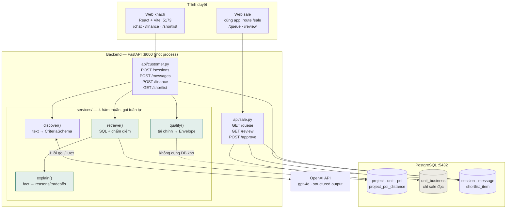
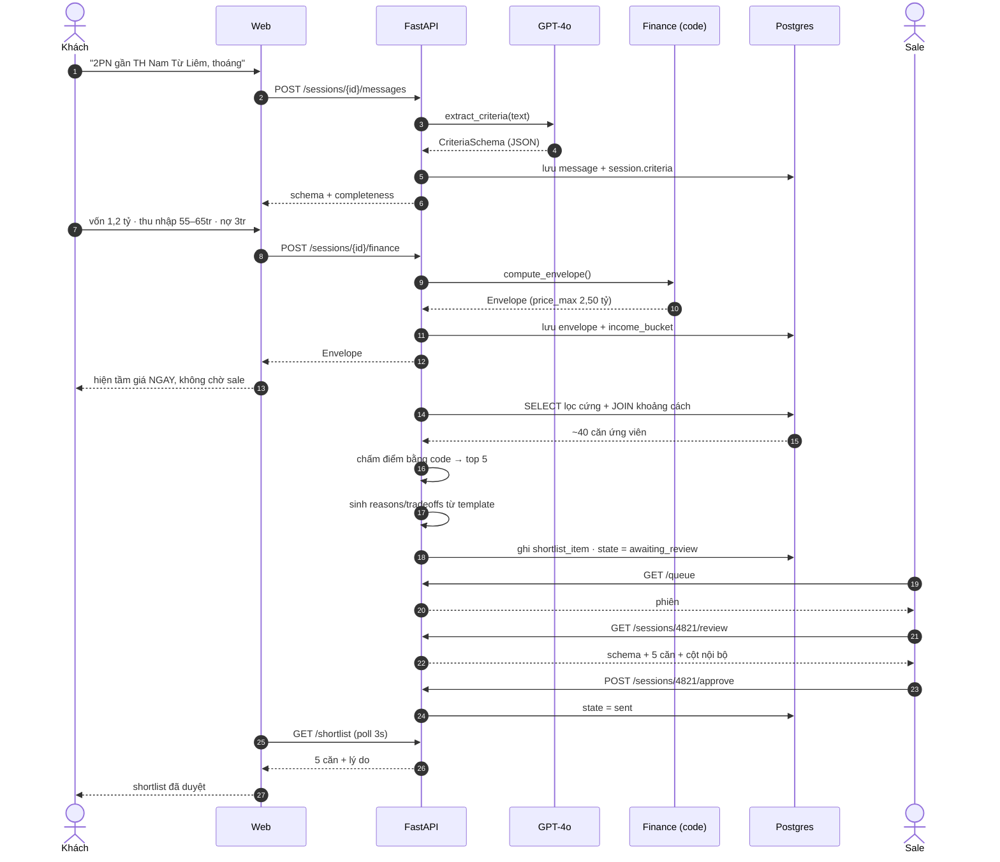
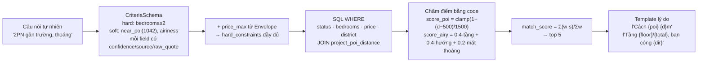

# HomeMatch — Architecture (prototype)

Phạm vi tài liệu này là **prototype chạy happy case**, không phải kiến trúc production. Những chỗ đơn giản hoá có ghi rõ ở mục 5.

---

## 1. Sơ đồ khối

**Ô xanh = không gọi LLM.** Chỉ `discover()` gọi OpenAI. Tài chính, lọc, chấm điểm, sinh lý do đều là code thuần — nên prototype chạy được cả khi mất mạng ra OpenAI (dùng form thay chat).

**Ô xám `unit_business`** chỉ có `api/sale.py` đọc. `api/customer.py` không import model đó — rò rỉ `business_priority` bị chặn bằng cấu trúc.

---

## 2. Luồng happy case

---

## 3. Dữ liệu biến đổi qua các bước

Điểm cần nhớ: **LLM chỉ biến đổi *câu hỏi*, không biến đổi *dữ liệu***. Kho căn giữ nguyên fact gốc.

---

## 4. Ai sở hữu phần nào

| Vùng | File | Owner | Contract với phần khác |
|---|---|---|---|
| Hợp đồng dữ liệu | `src/models/criteria.py` · `envelope.py` | Khuê | **Chốt trước tất cả.** Mọi người import từ đây |
| Kho + truy vấn | `src/services/retrieval.py` · `scoring.py` · `scripts/seed.py` | Đạo | Nhận `CriteriaSchema` + `Envelope` → trả `list[RankedUnit]` |
| Tài chính + API | `src/services/finance.py` · `src/api/*` | Tâm | Đã xong `finance.py`; chỉ bọc endpoint |
| Agent | `src/services/discover.py` | Khuê | Nhận `str` + schema hiện tại → trả `CriteriaSchema` |
| Web | `web/src/**` | Lâm | Chỉ gọi 6 endpoint ở mục 2, không gọi DB |

Bốn người làm song song được vì **contract là 3 kiểu dữ liệu**, không phải là code của nhau.

---

## 5. Những chỗ đơn giản hoá ở prototype

| Thật ra nên | Prototype làm | Vì sao chấp nhận được |
|---|---|---|
| JWT, 2 role | Header `X-Role: customer\|sale` + 2 user seed | Auth không phải thứ demo chứng minh |
| WebSocket đẩy shortlist | Poll `GET /shortlist` mỗi 3s | Đủ cho demo, ít code hơn nhiều |
| LLM diễn đạt lý do | Template f-string | Grounding 100% theo định nghĩa, không tốn token, không hallucinate |
| LangGraph 4 node | 4 hàm Python gọi tuần tự | Cùng chữ ký; bọc vào graph sau mất nửa ngày |
| pgvector cho tiêu chí mơ hồ | Không có | Tiêu chí đã phân rã thành công thức; chưa cần |
| Hội thoại nhiều lượt | Một lượt trích xuất, thiếu field thì hỏi lại 1 câu | Nhiều lượt là bước tiếp theo |
| Sale sửa tiêu chí, đổi hạng có lý do | Chỉ *duyệt* và *loại căn* | Đủ thoả HITL ở mức prototype |
| Docker Compose + Railway | `uvicorn` + `npm run dev` + Postgres trong Docker | Deploy là việc của W3 |

---

*Tài liệu liên quan: [Các bước build prototype](./prototype-plan.md) · [PRD](./prd.md) · [1-Page Brief](./brief.md)*